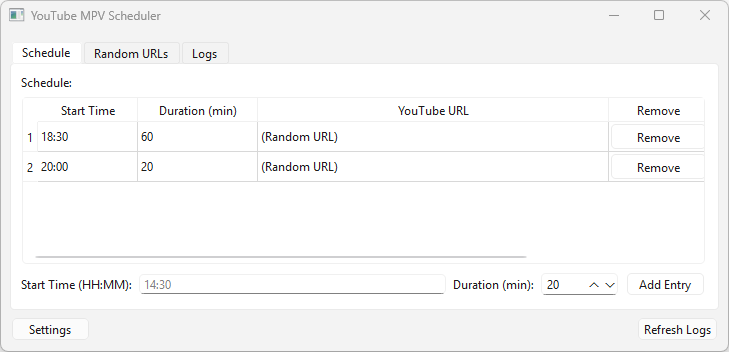

# Project Name

Short description of what this project does.

---

## Screenshot


---

## Features

- Feature 1
- Feature 2

---

## Installation

### 1. Create and activate a virtual environment
```bash
python -m venv .venv
.\.venv\Scripts\activate
```

### **2. Install dependencies**

```bash
python.exe -m pip install --upgrade pip
pip install xxx
```

### **3. Run the application**

```bash
python src/main.py
```

### **4. Package the application (optional)**

```bash
pip install pyinstaller
pyinstaller --onefile --icon=res/icon.ico src/main.py
pyinstaller --onefile --windowed --icon=res/icon.ico src/main.py
```

---

## Usage

---

## License

MIT
