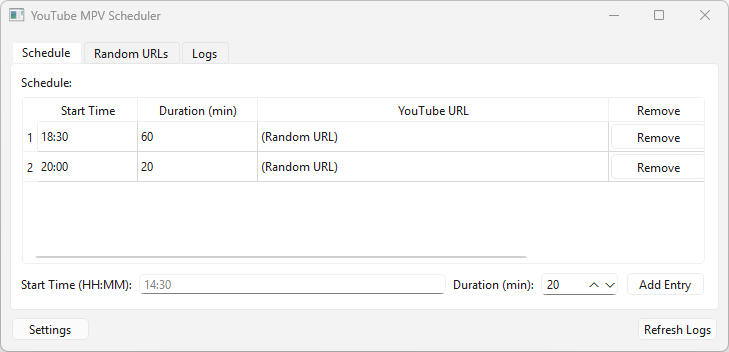
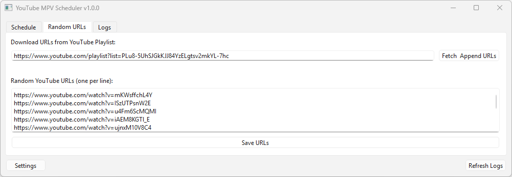

# YouTube MPV Scheduler
A Windows GUI application that plays YouTube videos at scheduled times using the MPV player.

## Screenshot



## Features
- **Scheduled Playback**: Set specific times for videos to start
- **Custom or Random Videos**: Use a specific URL for each schedule entry, or fall back to random videos from `youtube_url.txt`
- **Enable/Disable Entries**: Toggle schedule entries on/off without deleting them
- **Fullscreen Mode**: Videos play in fullscreen automatically
- **Single Instance**: Only one video plays at a time
- **Auto Video Switching**: Seamlessly picks the next random video when current one ends
- **System Wake-up**: Automatically wakes the system from sleep before playback
- **Comprehensive Logging**: All events logged to `logs/log_YYYYMMDD_HHMMSS.txt` with real timestamps
- **Settings Persistence**: MPV path and schedules saved automatically
- **Fetch Playlist URLs**: Download URLs directly from YouTube playlists and append to your URL list
- **Modular Architecture**: Clean separation of concerns with `wakeup_monitor.py` module

## Requirements
- Windows OS
- Python 3.8+
- PyQt6
- MPV player
- yt-dlp.exe 

## Installation

1. **Install Python dependencies:**
   ```bash
   pip install PyQt6
   ```

2. **Download and install MPV:**
   - Visit https://mpv.io/installation/

3. **Download yt-dlp.exe (optional):**
   - Visit https://github.com/yt-dlp/yt-dlp
   - Put yt-dlp.exe at the same location as mpv.exe

4. **Run the application:**
   ```bash
   python main.py
   ```

5. **Package the application (optional):**
   ```bash
   pip install pyinstaller
   pyinstaller --onefile --windowed --icon=res/icon.ico main.py
   ```

## Setup

### 1. Configure MPV Path
- Click **Settings** button
- Browse to your MPV executable (usually `C:\Program Files\mpv\mpv.exe`)
- Click **Save**

### 2. Add YouTube URLs
- Click the **Random URLs** tab
- Paste YouTube URLs (one per line), or use **Fetch & Append URLs** to download from a playlist
- Click **Save URLs**

Example:
```
https://www.youtube.com/watch?v=9bZkp7q19f0
https://www.youtube.com/watch?v=dQw4w9WgXcQ
```

### 3. Create Schedule
- Click the **Schedule** tab
- Enter **Start Time** (HH:MM format, e.g., `14:30`)
- Enter **Duration** in minutes
- (Optional) Enter a specific **YouTube URL** - if left blank, a random URL will be used
- Click **Add Entry**

### 4. Manage Schedule Entries
- **Enable** - Re-enable a disabled entry
- **Disable** - Disable an entry without deleting it (useful for temporary pauses)
- **Remove** - Delete the entry permanently

### 5. Fetch URLs from Playlist
- Click the **Random URLs** tab
- Paste a YouTube playlist URL in the **Fetch & Append URLs** field
- Click **Fetch & Append URLs**
- New URLs will be added to your list, duplicates are automatically skipped

## Files

- `main.py` - Main application
- `wakeup_monitor.py` - Monitor control module for system wake-up functionality
- `schedule.json` - Scheduled playback entries (with enabled/disabled status)
- `youtube_url.txt` - Random YouTube URLs (one per line)
- `config.json` - MPV path configuration
- `logs/log_YYYYMMDD_HHMMSS.txt` - Activity logs with real timestamps (new file per app launch)

## How It Works

1. Application monitors scheduled times
2. At scheduled time (if entry is enabled):
   - Uses the entry's specific URL if provided
   - Otherwise, picks a random URL from `youtube_url.txt`
3. System is woken from sleep if necessary
4. Launches MPV in fullscreen with the URL
5. When video ends, automatically plays next video (if within scheduled duration)
6. Continues until scheduled duration expires
7. All actions logged to `logs/log_YYYYMMDD_HHMMSS.txt`

## Keyboard Shortcuts (MPV)

- **ESC** - Exit fullscreen / Stop playback
- **Space** - Pause/Resume
- **→** - Skip forward 5 seconds
- **←** - Skip backward 5 seconds
- **M** - Toggle mute

## Logs

View application logs in the **Logs** tab or open log files directly from the `logs/` folder. Each application launch creates a new log file with the format `log_YYYYMMDD_HHMMSS.txt`. Logs include:

- Scheduled playback start/stop times
- Video URLs played (showing whether entry-specific or random)
- Video switches
- System wake-up attempts
- Errors and warnings

## License

Open source - feel free to modify and distribute.